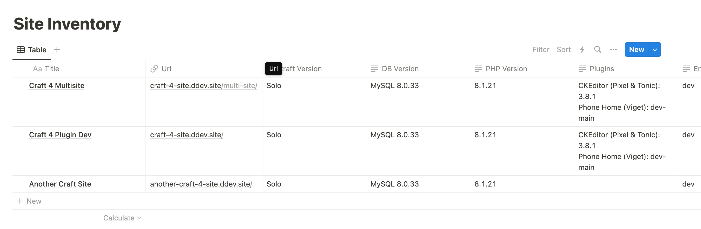

# Phone Home

Send version information about your site back to a central source

## Requirements

This plugin requires Craft CMS 4.3.5 or later, and PHP 8.0.2 or later.

## Installation

You can install this plugin from the Plugin Store or with Composer.

#### From the Plugin Store

Go to the Plugin Store in your project’s Control Panel and search for “Phone Home”. Then press “Install”.

#### With Composer

Open your terminal and run the following commands:

```bash
# go to the project directory
cd /path/to/my-project.test

# tell Composer to load the plugin
composer require viget/craft-phone-home

# tell Craft to install the plugin
./craft plugin/install phone-home
```

## Set Up Notion

This plugin sends site information to Notion Databases. Easily take inventory of your websites, version numbers and other important facts. 



### 1. Create an Internal Notion Integration

Follow the Notion docs to create an [internal integration](https://developers.notion.com/docs/getting-started#internal-integrations). You'll need to be a Workspace owner or use your personal workspace to set up an integration.

At the end of this process, you'll have a Notion integration secret key. You'll need this to configure the plugin.

### 2. Create a database and add it to your Notion Integration

Create a [new database](https://www.notion.so/help/guides/creating-a-database) in Notion. 

No need to add any columns or properties. This plugin will create them when it's first run. 

Next... [add your Notion Integration](https://www.notion.so/help/add-and-manage-connections-with-the-api#add-connections-to-pages) to the database.

### 3. Configure the plugin

You'll need to configure this plugin with your Notion integration's secret key and the ID of the database that is connected to the integration.

> [!TIP]  
> The database ID can be found by copying the link to the Notion DB's page ([see Notion Docs](https://developers.notion.com/docs/working-with-databases#adding-pages-to-a-database)).

Copy the contents of [src/config.php](/src/config.php) into your Craft project's `config` folder. Name the file `phone-home.php`.

Fill in the Notion `secret` and `databaseId` values. We recommend using an .env var for your secret keys.